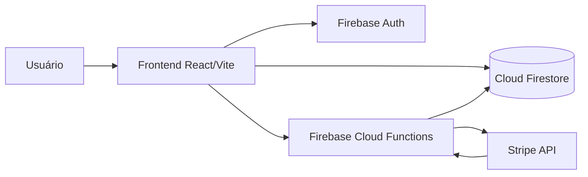
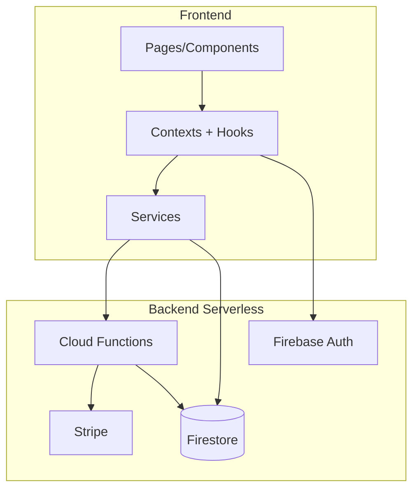
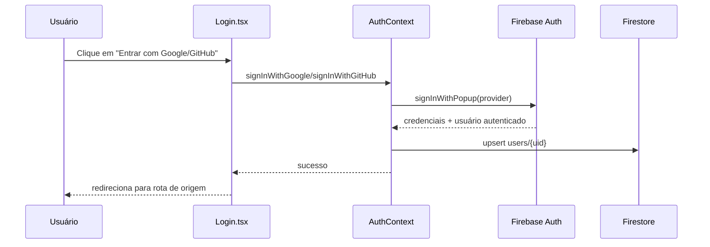
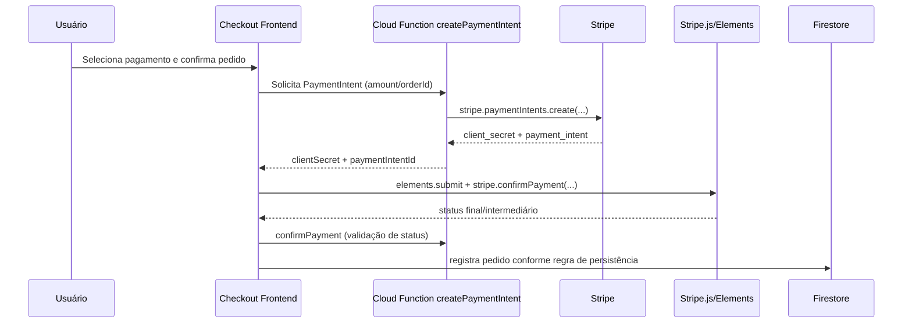
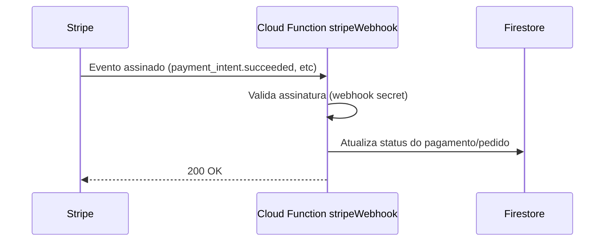

# RELATÓRIO TÉCNICO DE ARQUITETURA — PetHub

## 1) Objetivo

Este documento descreve a arquitetura técnica do projeto **PetHub**, com foco em:
- organização arquitetural (frontend + backend serverless),
- padrões adotados,
- boas práticas de clean code e padronização,
- fluxos de processamento e dados,
- modelos/diagramas representativos para entendimento e manutenção,
- atualização das últimas entregas em checkout/pedidos e Home.

---

## 2) Visão geral da arquitetura

O PetHub utiliza uma arquitetura moderna para aplicações web full-stack JavaScript/TypeScript:

- **Frontend:** React + TypeScript + Vite  
- **Backend serverless:** Firebase Cloud Functions (Node/TypeScript)  
- **Dados:** Cloud Firestore  
- **Autenticação:** Firebase Authentication (Email/Senha + Google + GitHub)  
- **Pagamentos:** Stripe (via Cloud Functions, sem exposição de chave secreta no frontend)  
- **Testes:** Vitest (frontend) + Jest (functions)

### 2.1 Princípios arquiteturais aplicados

1. **Separação de responsabilidades (SoC/SRP)**  
   - UI em páginas/componentes.
   - Estado de domínio em Context API + hooks.
   - Integrações externas em camada de services.
   - Operações sensíveis (Stripe Secret) no backend serverless.

2. **Arquitetura orientada a camadas**
   - Camada de apresentação.
   - Camada de estado e regras de aplicação.
   - Camada de integração/infraestrutura.
   - Camada de funções backend.

3. **Segurança por design**
   - Segredos fora do frontend.
   - Operações financeiras encapsuladas em Cloud Functions.
   - Validação de autenticação nas rotas sensíveis.

---

## 3) Mapa de componentes e responsabilidades

## 3.1 Frontend (React)

- `src/pages/*`  
  Responsável por composição de tela por domínio (Home, Login, Checkout, etc).

- `src/components/*`  
  Componentes reutilizáveis e de layout (`common`, `layout`, `home`, etc).

- `src/contexts/*`  
  Estado global por domínio (Auth, Cart, Checkout, Product).

- `src/hooks/*`  
  Encapsulamento de lógica reutilizável e consumo de contextos/services.

- `src/services/*`  
  Adaptadores de infraestrutura:
  - Firebase (`firebase.ts`)
  - Stripe client-side (`stripe.ts`)
  - pedidos (`orders.ts`)

## 3.2 Backend (Firebase Cloud Functions)

- `functions/src/index.ts`
  - `createPaymentIntent` (callable)
  - `confirmPayment` (callable)
  - `stripeWebhook` (HTTP endpoint)

## 3.3 Dados e autenticação

- Firestore:
  - produtos, pedidos e usuários.
- Firebase Auth:
  - login social Google/GitHub com persistência de perfil.

---

## 4) Diagramas arquiteturais (Mermaid)

## 4.1 Diagrama de contexto (C4 simplificado)

## 4.2 Diagrama em camadas (lógico)

## 4.3 Fluxo de autenticação social (Google/GitHub)

## 4.4 Fluxo de checkout/pagamento com Stripe

## 4.5 Fluxo webhook Stripe (confirmação assíncrona)

---

## 5) Padrões de projeto e decisões arquiteturais

## 5.1 Padrões aplicados

1. **Provider Pattern (Context API)**
   - Centraliza estado global de domínio (Auth, Cart, Checkout, Products).
   - Reduz prop drilling e melhora composição.

2. **Custom Hooks Pattern**
   - Expõe API de consumo simples para componentes.
   - Isola detalhes internos de estado/efeitos.

3. **Service Layer Pattern**
   - Cria fronteira entre aplicação e provedores externos (Firebase/Stripe).
   - Facilita manutenção e testes.

4. **Backend for Frontend (BFF) serverless**
   - Functions agem como camada de backend dedicada ao frontend.
   - Encapsula regras sensíveis (pagamento, validações e segredos).

## 5.2 Boas práticas adotadas

- Operações de pagamento no backend, nunca no cliente.
- Tipagem forte com TypeScript.
- Tratamento explícito de erros e retornos.
- Separação de código por domínio/pasta.
- Reuso de componentes UI e hooks.
- Evolução orientada por testes unitários essenciais.

---

## 6) Clean Code e padronizações de codificação

## 6.1 Convenções de código

- Nomes semânticos para funções/variáveis.
- Componentes com responsabilidade clara.
- Métodos de contexto com assinatura previsível.
- Evitar lógica de negócio extensa na camada de UI.

## 6.2 Legibilidade e manutenção

- Divisão em módulos menores.
- Evitar duplicação (DRY).
- Coesão alta por arquivo/domínio.
- Acoplamento reduzido via interfaces e services.

## 6.3 Tratamento de erros e UX

- Mapeamento de erros de autenticação social (popup blocked/closed/account conflict).
- Feedback visual (loading states por provedor).
- Mensagens orientadas ao usuário.

## 6.4 Segurança e compliance técnico

- Chaves secretas fora do frontend.
- Uso de validações em endpoints callable/webhook.
- Recomenda-se uso de Secret Manager para produção.
- Evitar comitar credenciais em repositório público.

---

## 7) Fluxos de dados e processamento (detalhado)

## 7.1 Fluxo de login social + persistência de perfil

1. Usuário inicia login social na tela de Login.
2. Frontend chama método social do AuthContext.
3. Firebase Auth abre popup do provedor.
4. Sucesso retorna usuário autenticado.
5. AuthContext faz upsert no Firestore (`users/{uid}`).
6. App recebe estado autenticado e redireciona.

## 7.2 Fluxo de criação de pagamento

1. Checkout calcula valor total e metadados.
2. Frontend chama `createPaymentIntent` (Cloud Function).
3. Function valida input/auth e cria PaymentIntent no Stripe.
4. Function retorna `clientSecret` e `paymentIntentId`.
5. Frontend valida elementos (`elements.submit`) e confirma pagamento via Stripe.js/Elements.
6. Frontend chama `confirmPayment` para confirmar status antes da persistência do pedido.

## 7.3 Regra de persistência de pedidos (atualizada)

A persistência de pedido no Firestore foi ajustada para refletir a regra de negócio:

- **Cartão aprovado:**  
  - `paymentStatus: 'approved'`  
  - `status: 'processing'` (mapeamento compatível com o tipo atual `OrderStatus`)

- **PIX/Boleto aguardando compensação:**  
  - `paymentStatus: 'pending'`  
  - `status: 'pending'`  
  - `paymentMethod` preservado (`pix`/`boleto`)

- **Pagamento não elegível/sem confirmação:**  
  - pedido **não é persistido**.

Além disso:
- o payload evita campos `undefined` (incluindo `paymentMethod`) para manter compatibilidade com validação do Firestore.

## 7.4 Fluxo de confirmação assíncrona via webhook

1. Stripe envia evento para `stripeWebhook`.
2. Function valida assinatura do evento.
3. Event handler identifica tipo de evento.
4. Firestore recebe atualização de status final do pedido.
5. Sistema mantém consistência eventual entre UI e backoffice.

---

## 8) Atualizações recentes de frontend (Home)

Arquivo principal atualizado: `src/pages/Home/Home.tsx`.

Funcionalidades adicionadas:
- vitrine de produtos com dados reais,
- ação de **adicionar ao carrinho** diretamente na Home,
- navegação para **detalhes do produto**,
- filtros por **categoria** e **faixa de preço**,
- estados de carregamento, erro e resultado vazio.

Impacto arquitetural:
- Home passa a atuar como ponto de entrada comercial com comportamento próximo ao catálogo,
- reaproveitamento de hooks/contextos existentes (`useProducts`, `useCart`),
- menor fricção no funil de compra (descoberta -> ação).

---

## 9) Qualidade, testes e observabilidade

## 9.1 Qualidade e testes

Executado:
- **Build de produção** com sucesso (`npm run build`), sem erros de TypeScript.
- validação funcional das novas regras e funcionalidades com confirmação do usuário.

Observação:
- warning de bundle grande do Vite (não bloqueante):
  - recomendada otimização por code splitting/lazy loading.

## 9.2 Observabilidade (estado atual e evolução)

Estado atual:
- logs básicos para depuração local/emulador.

Recomendado:
- padronização de logs estruturados (JSON),
- correlação por `requestId/orderId/paymentIntentId`,
- painel de métricas (falhas de auth/pagamento/webhook),
- alertas para erros críticos de pagamento.

---

## 10) Riscos técnicos e mitigação

1. **Exposição de segredo em frontend**
   - Mitigação: segredo apenas em Functions/Secret Manager.

2. **Inconsistência de status financeiro x pedido**
   - Mitigação: webhook assinado + reconciliação por status + regra de persistência condicional.

3. **Cobertura de teste insuficiente para E2E completo**
   - Mitigação: expandir para testes E2E automatizados (Playwright/Cypress).

4. **Bundle grande**
   - Mitigação: code splitting por rota, lazy loading, otimização de imports.

---

## 11) Recomendações e roadmap arquitetural

## Curto prazo
- criar página de histórico de pedidos pagos/pendentes por usuário,
- consolidar validações de método de pagamento no domínio,
- concluir thorough testing automatizado (UI + integrações Stripe sandbox),
- consolidar lint/build/testes em pipeline CI.

## Médio prazo
- aplicar code splitting por rotas críticas,
- adicionar testes de integração frontend ↔ functions,
- implementar política de retries/reconciliação de pedidos.

## Longo prazo
- observabilidade completa (logs, métricas, tracing),
- governança de segredos e rotação periódica,
- documentação viva (ADR - Architecture Decision Records).

---

## 12) Conclusão

A arquitetura do PetHub está alinhada com práticas modernas de aplicações full-stack JavaScript/TypeScript:
- frontend modular e tipado,
- backend serverless para regras sensíveis,
- integração segura com Stripe,
- autenticação social robusta,
- regras de persistência de pedidos aderentes ao status real de pagamento,
- Home evoluída para experiência de catálogo e conversão.

Com as melhorias propostas no roadmap, o projeto avança para um nível sólido de produção e portfólio técnico de alto valor para posicionamento profissional full-stack júnior.
